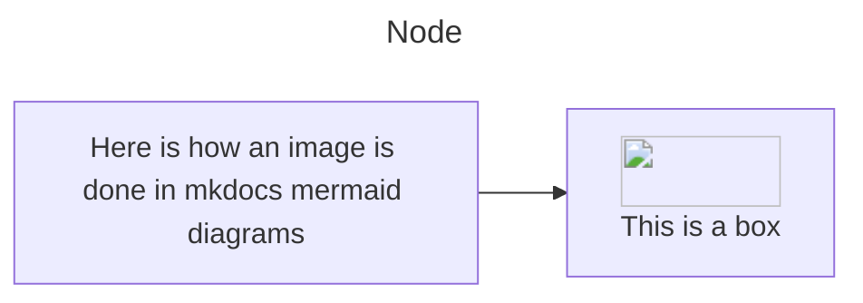

```mermaid
---
title: Node
---
 flowchart LR
     A["Here is how an image is done in mkdocs mermaid diagrams"]
     A --> B[<img src='https://iconscout.com/ms-icon-310x310.png' width='40' height='40' /> This is a box]
```
