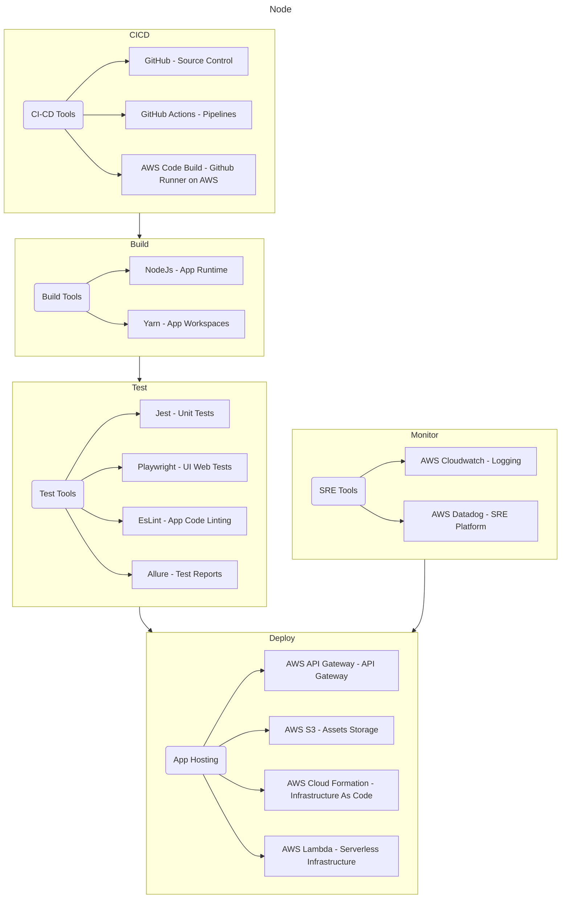

```mermaid
---
title: Node
---
 flowchart TB
    subgraph CICD
     A("CI-CD Tools")
     A-->A1[GitHub - Source Control]
     A-->A2[GitHub Actions - Pipelines]
     A-->A3[AWS Code Build - Github Runner on AWS]
    end

    subgraph Build
     B("Build Tools")
     B-->B1[NodeJs - App Runtime]
     B-->B2[Yarn - App Workspaces]
    end

    subgraph Test
     C("Test Tools")
     C-->C1[Jest - Unit Tests]
     C-->C2[Playwright  - UI Web Tests]
     C-->C3[EsLint - App Code Linting]
     C-->C4[Allure - Test Reports]
    end

    subgraph Deploy
     D("App Hosting")
     D-->D1[AWS API Gateway - API Gateway]
     D-->D2[AWS S3  - Assets Storage ]
     D-->D3[AWS Cloud Formation - Infrastructure As Code]
     D-->D4[AWS Lambda - Serverless Infrastructure]
    end

    subgraph Monitor
     E("SRE Tools")
     E-->E1[AWS Cloudwatch - Logging]
     E-->E2[AWS Datadog - SRE Platform]
    end
   CICD --> Build
   Build --> Test
   Test --> Deploy
   Monitor --> Deploy
```
