# Outlier or laggard: divergence and convergence in the UK’s recent inflation performance − speech by Dave Ramsden  

Given at Peterson Institute of International Economics, Washington DC 19 April 2024  

# Speech  

Thank you to the Peterson Institute for the invitation to participate in today’s event focussing on the CEPR volume on monetary policy responses to the post-pandemic inflation1. In line with the title of this panel I want to provide an update on my assessment of the evidence on what has caused the UK’s inflation2. This evidence covers the key indicators of inflation and in particular persistence as well as associated analysis and what this implies for the extent to which the risks from persistence are receding.  

Economic forecasters have had a challenging time over the last few years in forecasting the inflation process, given the series of unprecedented and overlapping shocks which have hit the global economy. These challenges were highlighted in Ben Bernanke’s comprehensive review of the Bank’s approach to, and use of forecasting published last week. A key recommendation of the Bernanke review is that the Bank should make more systematic use of scenarios in framing the outlook for inflation and the implications for monetary policy, in a world characterised by greater uncertainty and significant structural changes. The Bank has committed to implementing all the recommendations of the review. As someone who has used scenarios throughout my career, I think this is the right direction for the Bank to go in. But we should travel with a high degree of humility, given the ongoing uncertainties and complexities we face in forecasting inflation.  

Throughout much of 2023 I was worried that the UK was an outlier among advanced economies, diverging in terms of inflation performance and the degree of persistence. And this was still a feature at the time of the MPC’s last published forecast, in the Monetary Policy Report (MPR) published in early February. The MPC’s forecast showed UK inflation first falling to the $2\%$ inflation target in 2024Q2, before rising back to close to $3\%$ by 2025Q1, largely due to persistence in domestic inflationary pressures.  

But over the last few months I have become more confident in the evidence that risks to persistence in domestic inflation pressures are receding, helped by improved inflation dynamics. As we set out in our March 2024 minutes there is a range of views among the MPC on these risks. For me the balance of domestic risks to the outlook for UK inflation, relative to the February MPR forecasts, is now tilted to the downside, with a scenario where inflation stays close to the $2\%$ target over the whole forecast period at least as likely. This leaves the UK as less of an outlier and more of a laggard in terms of recent inflation performance, and one that is now catching up quickly.  

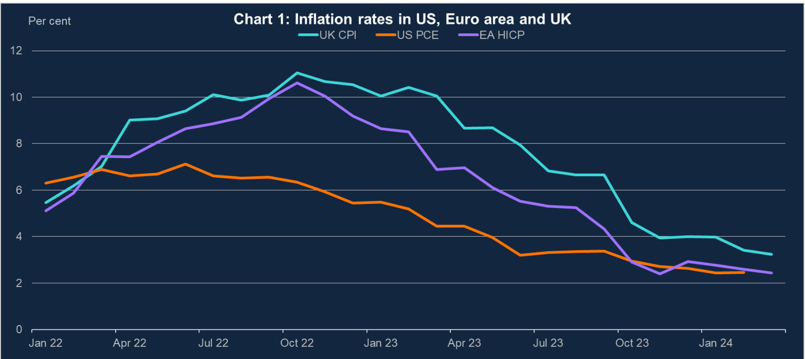  
Sources:ONS for the UK, BEA for the US, Eurostatfor the EA and Bank calculations.  

Chart 1 shows how UK inflation has evolved relative to the US and Euro area since the beginning of 2022. As the CEPR study documents, all three experienced the first-round effects of the shocks associated with the Covid pandemic and Russia’s invasion of Ukraine to varying degrees, which primarily impacted on goods, energy and food prices. As a net energy exporter, the US was much less affected by the increase in energy prices than the Euro area and UK, with US inflation peaking at $7.1\%$ in the summer of 2022, two-thirds of the $1\,1\,\%$ peak in Euro area and UK inflation, which was seen later, in autumn 2022. The nature of the support given to UK households and businesses to cushion the impact on energy bills contributed to UK headline inflation staying higher than Euro area inflation throughout $2023^{3}$ .  

The Fed, ECB and Bank, along with most other central banks tightened policy to head off the risk that second round effects in domestically driven inflation took hold, in the context of tight labour markets. The three central banks made historically large and rapid increases in policy rates in successive increments of 50bp and through much of 2022, and into 2023 in the case of the Bank and ECB.  

For the UK, the risks from above target inflation becoming entrenched were considered sufficiently significant that, having reduced the pace of policy rate increases to 25bps last March and May, the MPC stepped up the pace again, with a 50bp hike in June 2023, as shown in Chart 2. The MPC’s assessment of the risks emphasised three key indicators of persistence:  labour market tightness, private sector wages and services inflation. Trends in these indicators have also played an important part in the MPC’s decision to hold  

Bank Rate at $5.25\%$ since last August, alongside communications which have stressed the need for monetary policy to remain restrictive for an extended period of time, in order to slow the economy and bring inflation sustainably back to the $2\%$ target.  

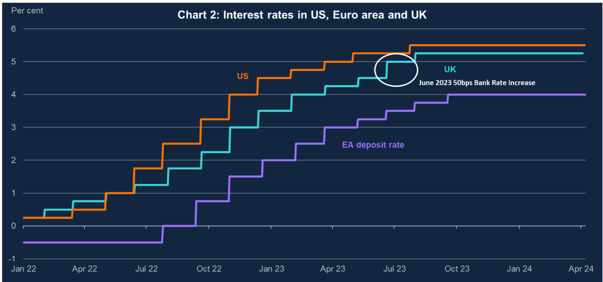  
Sources:Bankof England,European CentralBank andFederal Reserve.  

# Recent inflation developments  

US and Euro area inflation fell sharply through 2023, driven primarily by falling energy prices (electricity and gas), with their contribution to inflation turning negative in the spring and summer respectively, as Chart 3 illustrates. The unwinding of first round effects is also increasingly evident in the easing in core goods and food price inflation, which are directly and indirectly impacted by energy prices.  

By last September, headline inflation had fallen sharply to $3.4\%$ in the US and $4.3\%$ in the Euro area, compared to $6.7\%$ in the UK, leaving the UK clearly standing out.  This divergence was broad based but also in part reflected the timing of UK energy interventions relative to those across Europe which prolonged the impact of high energy prices on UK inflation. For example, the first big fall in the Ofgem price cap only came in October 2023, falling by $27\%$ relative to the previous year.  

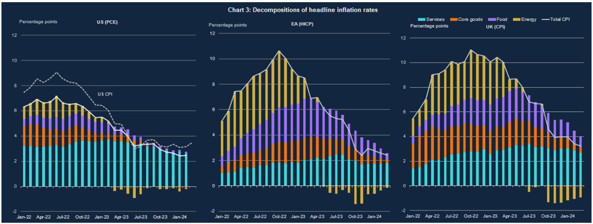  
Sources:ONSfor theUK,BEAfor theUS,Eurostatfor theEA and Bank calculations.  

Second round effects are most evident in services inflation, which is relatively labour intensive – direct labour costs are responsible for around half of services costs in the UK – and more domestically orientated. In the UK services inflation was $6.9\%$ as recently as September 2023, contributing to around a half of total CPI inflation at that time.  

Based on its assessment of a range of evidence, including the three key indicators of persistence, the MPC judged that second-round effects in domestic prices and wages were expected to take longer to unwind than they did to emerge – in other words they were likely to be asymmetrical. As a result, through last year the MPC judged there would be significant persistence in wage and price setting, which was built into the projections for wages and prices.  

Furthermore, the risks to inflation both from persistence and from energy prices following the emerging conflict in the Middle East were judged to be skewed to the upside. In the November 2023 MPR forecasts shown in Table 1 modal and mean CPI inflation did not return to the $2\%$ target until around the start of 2026.  

Table 1: February 2024 and November 2023 MPR inflation forecasts   

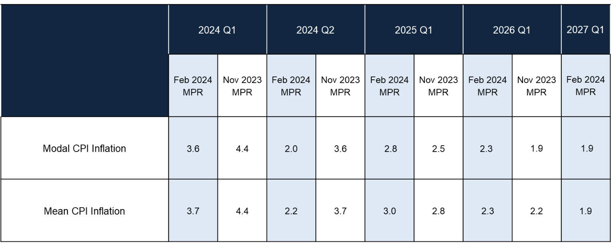  

In the February 2024 MPR, in view of the more recent improving trends in the key persistence indicators and in headline inflation, the MPC forecast that on the central case CPI inflation would fall to $3.6\%$ in 2024Q1 and to $2.0\%$ in 2024Q2. The latest release published on Wednesday showed CPI inflation fell to $3.5\%$ in Q1 and $3.2\%$ in March.  

In its February forecasts the MPC also reduced the size of the persistence judgement and removed the upwards skew for domestic inflation risks, as these had become more balanced. In terms of the published forecasts shown in Table 1 this effect was more than offset by the significant downwards shift in the yield curve between November and February, itself in part reflecting the better news on UK inflation, which pushed up demand and inflation further out, leaving the modal forecast at $2.8\%$ in 2025 Q1.  

# Four steps in the inflation/inflation expectations/wages nexus  

The upcoming MPC round will be an opportunity to revisit all of our forecast judgements. When thinking about current UK inflation dynamics and the interaction between first and second round effects I find it useful to distinguish four steps in the inflation/inflation expectations/wages nexus4.  

Step one is characterised by the feed through of dissipating external inflationary pressures on headline inflation. As already outlined first round effects from external inflationary pressures, primarily stemming from energy prices, were particularly prominent in driving the increase in UK energy, food and core goods prices.  As recently as September 2023 they still contributed 3.5 percentage points, more than half of $6.7\%$ total inflation shown in  

Chart 4. In the latest data for March 2024 the contributions from these pressures combined has fallen to around zero.  

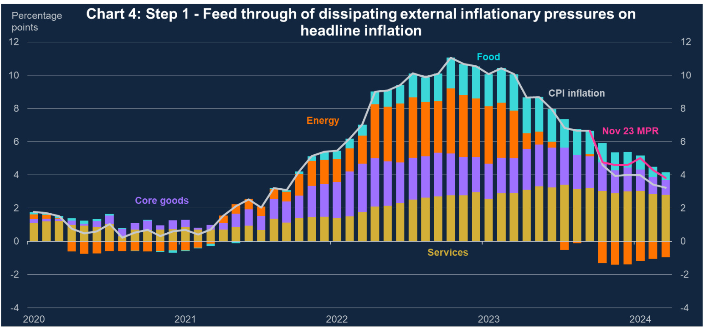  
Sources: Bloomberg Finance L.P., Department for Energy Security and Net Zero, ONS and Bank calculations.  

The assumptions we use to condition the outlook for energy were until the recent rises broadly unchanged compared to what conditioned the February MPR forecast. Clearly the risks from events in the Middle East remain to the upside. Food and core goods inflation have continued to fall, broadly as expected in the February MPR.  

As a consequence, headline inflation has fallen broadly in line with the February MPR forecast, to $3.2\%$ in March. Given we know the level of the Ofgem price cap for April and also taking account of the freezing of fuel duties in the March Budget, then other things equal we can be confident headline CPI inflation will fall sharply in April, to close to the $2\%$ target.  

In step two of the nexus, falls in headline inflation have lowered inflation expectations. As headline inflation has fallen back materially since November 2023 household and business medium- term measures of inflation expectations have come back in line with historical averages. Market measures of medium-term inflation expectations continue to remain more elevated, although off their peaks. More recently, I’ve started to focus more on shorter-term expectations given the closer correspondence to headline inflation and importantly their significance in our understanding of wage dynamics.  

In the Bank’s most recent Inflation Attitudes Survey, shown in Chart 5, year-ahead expectations for inflation fell to $3\%$ , their lowest level for just over two years. And the Citi/YouGov survey for one-year-ahead expectations fell to $3.3\%$ in March 2024 compared to $4.2\%$ in October 2023. Similarly in the latest Decision Maker Panel survey business inflation expectations for a year ahead were $3.2\%$ , falling from $4.6\%$ in October 2023.  

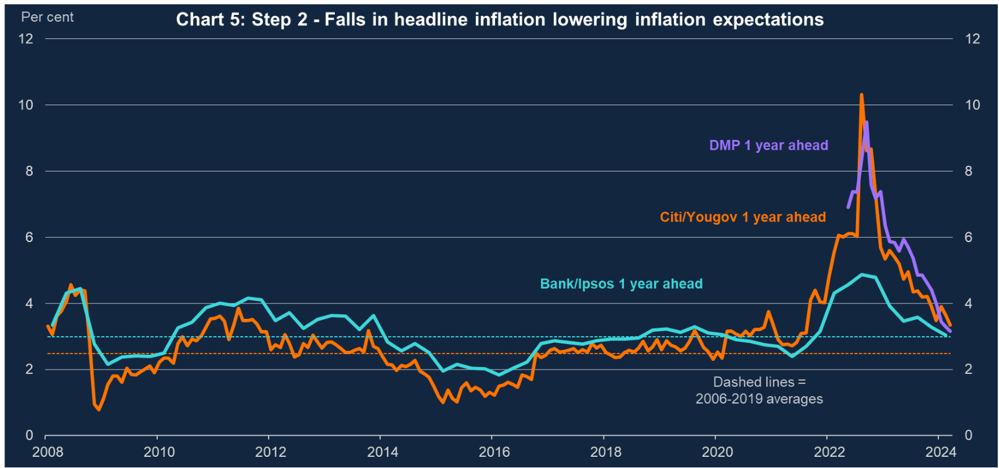  
Sources:Bank of England, Bloomberg Finance L.P., Citigroup, DMP Survey, YouGov and Bank calculations.  

In step three the easing in inflation expectations is a key driver in weakening pay growth, as illustrated in Chart 6. Annual private sector regular pay growth has fallen from just over $8\%$ in 2023Q3 to $6.0\%$ in February 2024.  

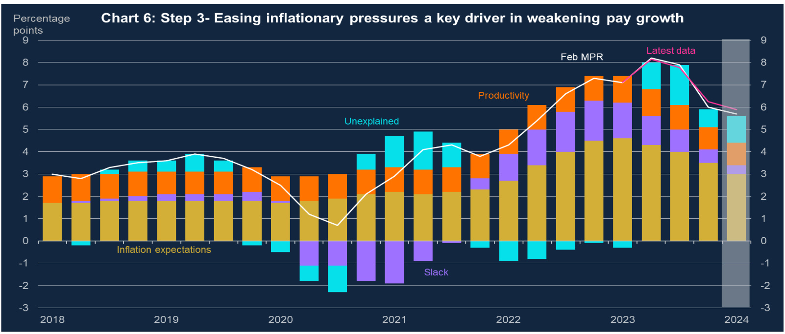  
Sources: ONS and Bank calculations.   
(a)Wage equation based onYellen (2017).Private sector regular pay growth is Bank staff's estimate of underlying pay growth between January 2020 and March 2022 and ONS private sector regular pay growth otherwise. Short-term inflation expectations are based on the Barclays Basix Index and the YouGov/Citigroup one year ahead measure of household inflation expectations and projected forward based on a Bayesian VAR estimation. Slack is based on the MPC's estimate of the vacancies to unemployment ratio. Productivity growth is based on longrun market sector productivity growth per head. The unexplained component is the residual. Data are to 2023 Q4, projections are for 2024 Q1.  

Drawing firm conclusions on the evidence from the labour market is hindered by the issues with the official LFS data on labour market quantities. And separately, also by the volatility in the official average weekly earnings series. So the MPC and other forecasters have had to put more reliance on a wider range of labour market evidence and alternative models of pay growth5.  

Notwithstanding these uncertainties and against the backdrop of a technical recession in GDP in the second half of 2023, the UK labour market has clearly continued to loosen. This is apparent from a range of indicators including the official LFS data, the REC survey and intelligence from the Bank’s network of Agents. It is clearly evident in the decline in the ratio of vacancies to unemployment, the MPC’s preferred measure of labour market tightness, shown in Chart 7, which has now fallen to pre-covid levels. This easing in labour market tightness has also contributed to the recent slowing in earnings growth shown in Chart 6.  

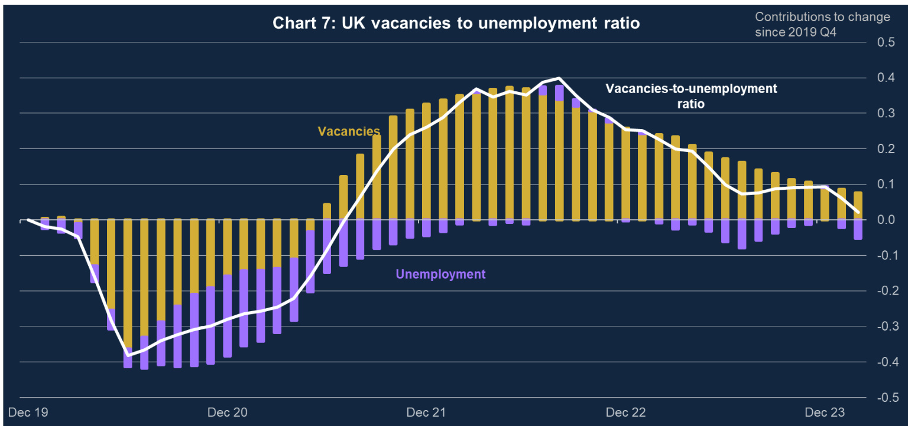  

Sources:ONSand Bankcalculations.  

As Andrew Bailey highlighted recently, the UK is experiencing disinflation at close to full employment; with unemployment remaining at close to historic lows. For me, the most likely explanation for the ongoing resilience of the UK labour market has been a combination of labour hoarding, as businesses expect the weakness in activity to be short lived, consistent with intelligence from the Bank’s Agents, in the context of continued weak participation.  

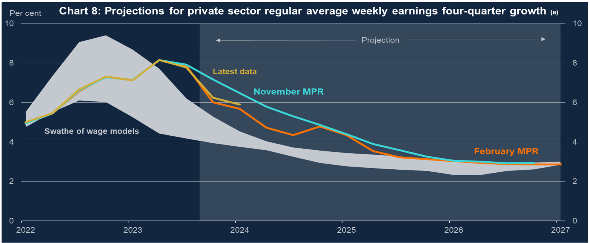  
Sources: Bloomberg Finance L.P., Citigroup, ONS, YouGov and Bank calculations.   
(a) The shaded range represents a range of projections from three statistical models of nominal private sector regular average weekly earnings growth, including a wage equation based on Yellen (2017), a wage equation based on Haldane (2018) and a simple error-correction model based on productivity, inflation expectations and slack in the labour market as embodied in the difference between the actual unemployment rate and the Committee's estimate of the medium-term equilibrium rate. The projections are dynamic, multi-step ahead forecasts beginning at a point within the models' estimation periods and are sensitive to data revisions, which can lead to changes in the range overthe past as well as over the forecast period.  

Chart 8 illustrates that from early in 2023, earnings rose by significantly more than could be explained by our three main models, shown by the swathe6.  In response the MPC made a judgement to build in more persistence in the wage forecast; a judgement that got progressively larger, peaking in the November MPR projections. As I highlighted in a speech last November, judgements are a feature of all economic forecasts, but this was a particularly significant one. Given more recent trends in earnings and labour market tightness the judgement was reduced in the February 2024 MPR forecasts, but it still pushed earnings growth on average about 1 percentage point above the swathe of model estimates in the first half of the forecast.  

In terms of short-term trends, our indicator-based models of pay growth suggest that underlying regular pay growth has already slowed to around $5\%$ from a peak of around $8\%$ . Later in the spring we will see the impact of the increases in the National Living Wage feed through into the aggregate earnings data.  The MPC’s forecast is for earnings growth to slow further from the current level of $6.0\%$ as headline inflation and inflation expectations continue to fall, against a backdrop of still weak activity and ongoing loosening in the labour market.  

In step four of the nexus, weaker pay growth has started to feed into weaker services inflation, which further broadens out the disinflationary process. In the November 2023 MPR our short term forecast for CPI inflation – which is built bottom-up and relatively mechanically from the components and is shown in Chart 9 – had services inflation staying at around $7\%$ until the end of 2023, a similar path as in August. It was then projected to fall to $6.4\%$ by March 2024.  

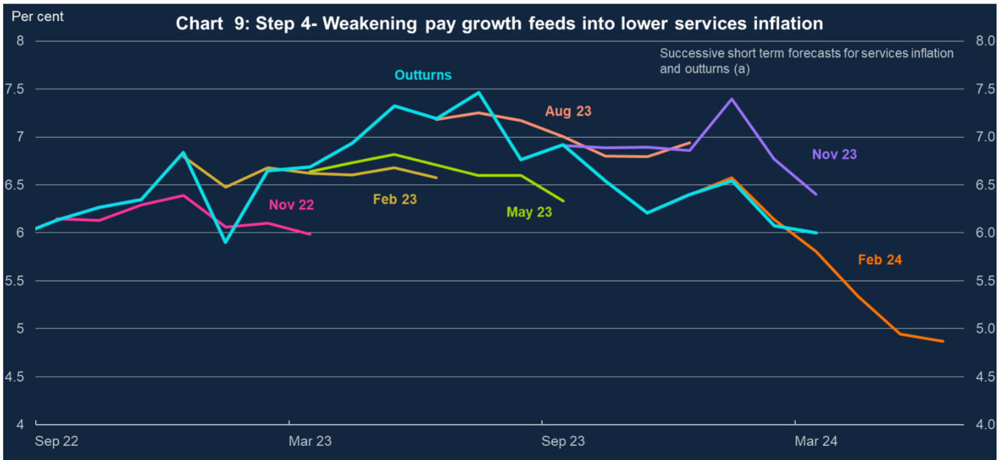  
Sources: ONS and Bank calculations.  

(a)Forexample,Feb2024 line shows forecasts throughto June 2024,consistent with theFebruary MPR CPIforecasts.  

In the latest data services inflation continued to fall in March to $6.0\%$ , slightly above the short-term forecast underpinning the February MPR forecasts.  

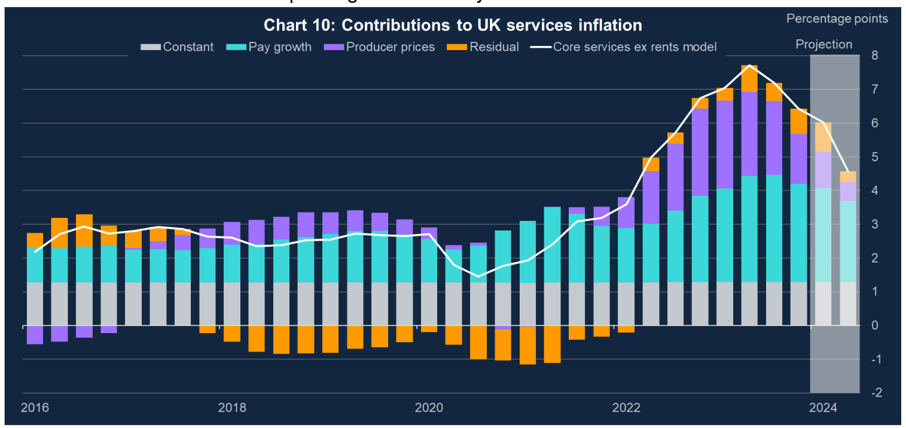  

Chart 10 provides a decomposition of one measure of underlying services inflation that the MPC looks at. It suggests that the fall from its peak last summer reflected moderating pay growth but also weaker producer prices for services. The short-term projections are consistent with the February MPR and illustrate that large base effects from last year will drop out in 2024Q2.  

The rationale for focusing on an assessment of services inflation as an indication of persistence has been that services prices more reflected domestic inflationary pressures, in large part from the labour market, and that these pressures are inherently more slow moving or stickier, particularly when labour markets are tight. A recent BIS paper supports similar line of argument based on cross country comparisons8.  

But there is also analytical evidence that services inflation has been determined to a greater extent by the energy prices shock. For example, by estimating the effect using the most recent data and exploiting the cross-country differences in energy prices my former MPC colleague Jan Vlieghe finds energy prices to be more important in driving services9. And the Bank’s neural network model for services inflation, one of the recently developed cross-check modelling approaches the MPC deploys, also finds a significant role for energy prices10.  

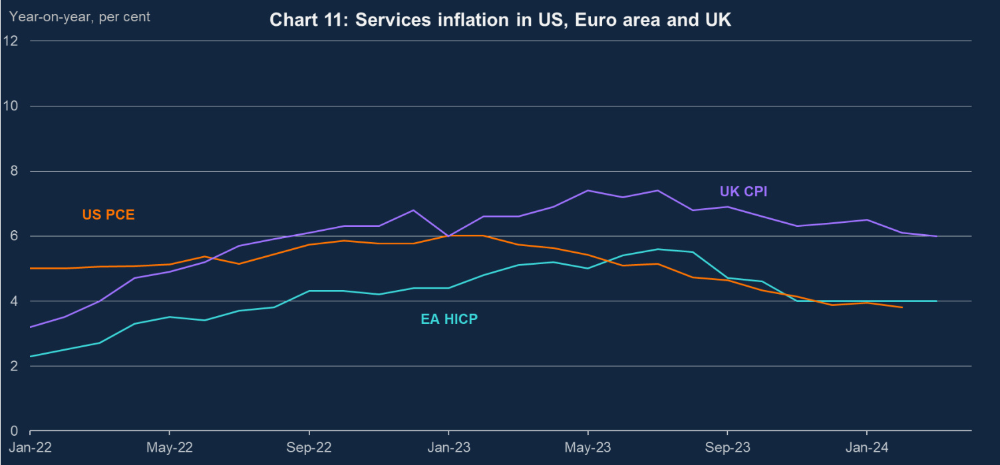  

Sources:ONSforthe UK,BEA forthe US,EurostatfortheEA and Bank calculations.  

This does not mean that the MPC’s assessment that services inflation reflects stronger and more persistent domestic inflationary pressures doesn’t apply. As Chart 11 shows the UK is still clearly an outlier when comparing 12-month services inflation rates with the equivalent rates in the US and Euro area.  

But from my perspective it does imply that while services inflation continues to be more homegrown, we should place more weight on the likelihood that a greater part of recent services inflation will dissipate more quickly and so lead to less persistence, as the impact of the energy price shock unwinds.  

Chart 12 shows that the UK’s 3-month annualised run-rate for services inflations has recently converged on the equivalent rates for the US and Euro area. And I expect this to become increasingly the case for 12-month rates. This in turn will mean that services inflation contributes less to headline CPI inflation rates.  

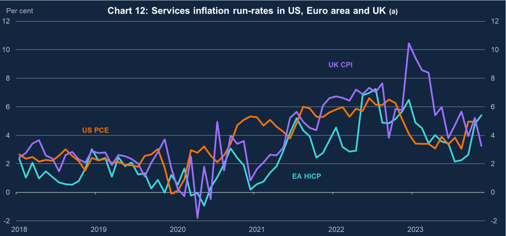  

Sources: Bureau of Economic Analysis, Eurostat, ONS and Bank calculations.  

(a) 3-month average, monthly annualized. Seasonally adjusted.  

I think it is also notable that the inflation dynamics implied by the nexus are playing out against a backdrop of continuing weak activity in the UK, reflecting the impact on demand of restrictive monetary policy, as well as the constraining influence of subdued supply. UK supply growth has been characterised by weak productivity growth and low levels of participation.  

UK GDP grew by $0.1\%$ in February after $0.3\%$ growth in January, implying an end to the technical recession in the second half of last year. But GDP is still 0.1 per cent lower than it was two years ago in 2022Q1, when energy prices surged after Russia’s invasion of Ukraine. Over the same period  US GDP has grown by a robust $4.3\%$ .  

# Conclusion  

To conclude the UK looks like less of an outlier in terms of recent inflation performance and more of a laggard. And one that is catching up fast. Similar disinflationary effects to those which started earlier in the US and Euro area are now coming through, leading to a pronounced reduction in UK inflation.  UK CPI inflation in March was below US CPI inflation and the April data is very likely to show the UK converging in line with Euro area inflation. There are likely to be bumps in the disinflation process from one month to the next due to base effects and other one-off factors. But a more material distinction is that the disinflation process in the US is taking place against the backdrop of a stronger economy, particularly on the demand side, and is already proving to be less smooth.  

At the MPC’s last meeting in March I was one of eight members who voted to hold Bank Rate at $5.25\%$ . Over the last few months, I have become more confident in the evidence that risks to persistence in domestic inflation pressures are receding, helped by improved inflation dynamics.  

As we set out in the March minutes there is a range of views among the MPC on these risks. As I’ve explained today, developments in the nexus of inflation, inflation expectations and wages, including at higher frequencies, suggest that the restrictive stance of policy and the more symmetric unwinding of second round effects are also reducing the more persistent components of inflation such as services inflation.  

My assessment is that the balance of domestic risks to the outlook for UK inflation is now tilted to the downside compared to the MPC’s February 2024 forecast, with a scenario where inflation stays close to the $2\%$ target over the whole forecast period at least as likely as the February 2024 forecast, which showed inflation rising back above target to close to $3\%$ by 2025Q1.  

The MPC will have to consider collectively the degree of restrictiveness of policy at each upcoming meeting to ensure inflation returns sustainably to the $2\%$ target. I will continue to take a watchful and responsive approach to my policy decisions as I have tried to do throughout this period of unprecedented structural shocks. Watchful, in terms of assessing the evidence as it accumulates and responsive in terms of the stance of monetary policy warranted by the evidence.  

I would like to thank Rupal Patel for her assistance in drafting these remarks. I would also like to thank my fellow MPC members and numerous Bank colleagues, including Andrew Bailey, Nick Bate, Stuart Berry, Fabrizio Cadamagnani, Alan Castle, Jonathan Haskel, Josh Martin, Waris Panjwani, Galina Potjagailo, Adrian Paul, Alister Ratcliffe, Andrea Rosen, Victoria Sapota, Fergal Shortall, Kenny Turnbull and Danny Walker for their many helpful contributions.  